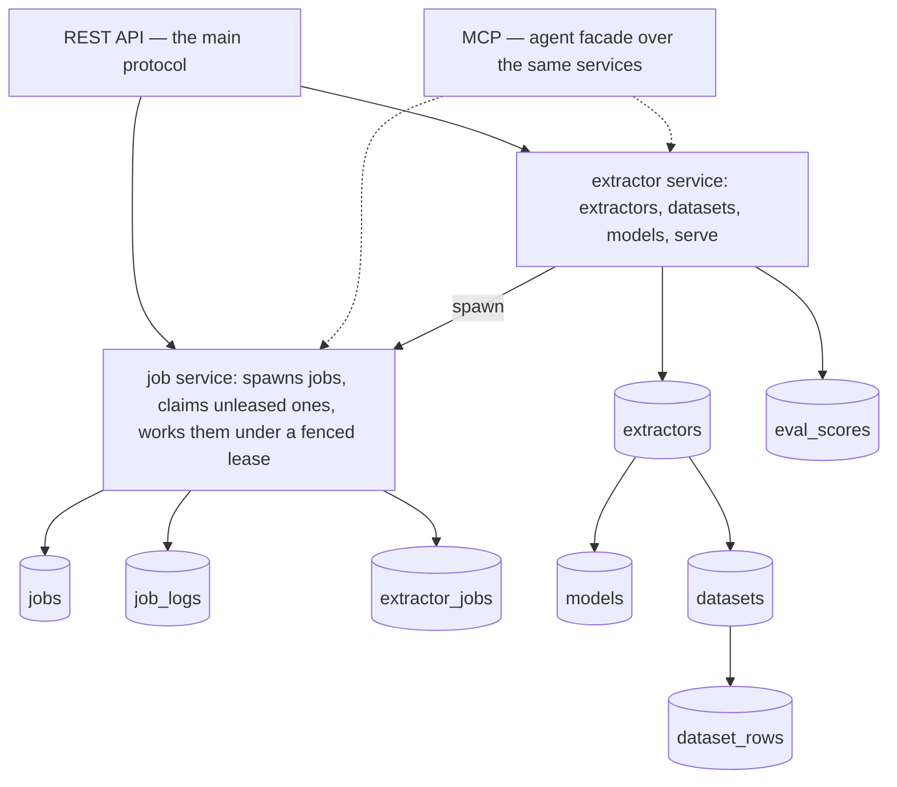

# Architecture

## The system

The job service owns the job tables. Other services spawn work by calling it through a dependency they declare — the interface is inverted, owned by the caller. Workers claim jobs from the table, so worker processes beyond the first need nothing but the database.

## Entities

**Extractor** — the unit users create, own and improve: source columns + schema + datasets + models. Two model roles, set through extractor update: the specimen fills dataset gaps; the serving model answers `serve`, falling back to the specimen when unset. Table `extractors`: id, name, description, schema `jsonb`, source_columns `text[]`, specimen_model_id (nullable FK → models), serving_model_id (nullable FK → models), created_at, updated_at.

**Source columns** — a named list outside the schema, untyped: values are strings. One wire name everywhere: the names are `source_columns`; a row of values is `source_values`, a map of column name to string. A missing, non-string or unknown source field is a named row error. The list is create-only — renaming or dropping one would invalidate every stored row.

**Schema** — the derived columns, one JSON per extractor: JSON Schema draft 2020-12 with `"type": "object"` and at least one property. Top-level fields are the columns; a column's content may be non-flat. Columns are nullable by default — derived values are validated with every column wrapped `anyOf` null and `required` dropped; missing fields normalize to `null`; unknown columns are rejected. Per-column metric config rides the `x-el` keyword: `{"metric": <kind>}` on a column, or on an array column's `items` for the element metric; unknown `x-el` keys are rejected; `x-el` is stripped before any LLM call. A schema edit adds and removes columns only, applied in the write itself: an added column reads null on older rows, a removed one drops its values, and a type change is refused — per-column migration functions are a later capability.

**Model** — a procedure `(source_columns) => (derived_columns)` held as a specification JSON. Implementations may be LLM, code or classic ML; the MVP ships LLM + prompt. Models are immutable and deletable: forking inserts a full copy with edits applied at creation, no lineage kept; training inserts a new model rather than touching its base. `known_datasets` holds every dataset id the model has trained on, so an eval over data the model has seen is visible as such. Table `models`: id, extractor_id, specification `jsonb`, known_datasets `int[]`, created_at, updated_at.

**Dataset** — a named, described set of rows under one extractor; an extractor can have several, and training and evals select them at start time — several on either side. A row's `values` maps column name → value for source and derived columns alike. Provenance is per row: `source` is `ai` or `human` — a fill job marks the rows it touched `ai`, a human acceptance flips the row to `human`. Tables — `datasets`: id, extractor_id, name, description, created_at, updated_at. `dataset_rows`: id, dataset_id, values `jsonb`, source `text`, created_at, updated_at.

**Metric** — a function `(expected, actual) -> [0, 1]` per derived column, configured in the schema and interpreted at the service layer. Kinds: `exact`, `normalized_exact`, `levenshtein`, `embedding`, `ordered_array`, `unordered_array`, more later. Defaults: `exact`; an array column defaults to `unordered_array` with `exact` elements. Null rule: both null scores 1, exactly one null scores 0. An array column takes an array kind and its elements a scalar one: `unordered_array` pairs elements by optimal 1:1 assignment (Hungarian), `ordered_array` compares by position; either way unmatched elements score 0 and the total is divided by the larger length. `embedding` scores cosine similarity, clamped to [0, 1], from vectors an embedding provider returns — identical values score 1 without calling it.

**Eval** — a job that runs a model over chosen datasets, every row or a random sample of N. Row score is the mean of its column scores — columns weigh equally, no weight configuration; eval score is the mean of row scores; per-column means are kept so a failing column is visible, not averaged away. The settings live in the job's payload, the aggregates in its result metadata; per-row scores land append-only as the run progresses, written by the eval job kind itself — the job machinery knows nothing of them. Every eval is history; error and killed runs keep their partial scores. Table `eval_scores` (append-only): id, job_id, dataset_row_id, field_scores `jsonb`, row_score, created_at — `dataset_row_id` is a plain reference, not a cascading FK, so eval history survives the rows it scored being edited or deleted.

**Job** — the one shape of asynchronous work: gap-filling, evals, training, agentic drafting, system maintenance — a job need not belong to an extractor. A job is a database row a worker claims under a fenced lease and works with a ~2s tick: renew the claim, pull the signal, write a small progress JSON polled through the API. Checkpoints at logical boundaries make jobs resumable and idempotent. Status is `running` from insert until it settles at `stopped`, `done`, `error` or `killed`; a `running` row is claimable while its `claimed_at` is null or past the claim TTL, so a dead worker's job needs no transition to be taken again. A job carries kind-specific metadata (an eval job, its aggregates), so one jobs interface shows every kind. Mechanism: `docs/decisions/0011-jobs-claimed-from-the-database.md`. Tables — `jobs`: id, kind, description, payload `jsonb`, checkpoint `jsonb`, progress `jsonb`, status, error, signal, claim_id `uuid` (nullable), claimed_at (nullable), created_at, updated_at, finished_at. `job_logs` (append-only): id, job_id, at, level, message, data `jsonb`. `extractor_jobs`: extractor_id, job_id, created_at — a query index written at spawn; the payload's `extractor_id` is authoritative; system-owned jobs have none.

## API

### REST

The main communication protocol: resource-oriented, with an OpenAPI document the UI generates types from. Writes take and return whole values; a batch or command route is a `POST` naming the operation. A transport never defaults a missing client field — absent is an error or a declared optional. Every list is cursor-paginated: `after_id` + `limit`, with `<sort_column, id>` as the cursor under a custom sort. Domain errors map to codes: not found → 404; validation → 422 carrying per-row messages in `details`; upstream model failure → 502; any other domain error → 400.

- `POST /extractors`, `GET /extractors`, `GET /extractors/{id}`, `PUT /extractors/{id}`, `DELETE /extractors/{id}` — update carries name, description, schema and both model roles; `source_columns` is create-only. `GET /extractors/{id}` carries its datasets' and models' ids, names and lightweight data, so no nested listing routes exist.
- `POST /extractors/{id}/serve` — the serve path, what a client's production app calls: one `source_values` row in, its derived row out, through the serving model (neither role configured is a named 400). Unbatched. Spends model money with no privilege boundary until auth lands.
- `POST /extractors/{id}/jobs/fill-gaps`, `.../jobs/train`, `.../jobs/eval` — spawn the job with its settings (datasets, model, target metric, sample) and return it (202). Gap-filling with no specimen is a named 400.
- `GET /extractors/{id}/jobs` — the extractor's jobs, filterable by kind and status, sortable by created_at or duration.
- `GET /datasets`, `POST /datasets` (extractor_id in the body), `PUT /datasets/{id}` (name, description), `POST /datasets/{id}/import` (appends rows from the passed file, best-effort with per-row rejections), `GET /datasets/{id}/rows`.
- `POST /rows` — batch upsert and delete: rows carry their dataset ids, values are validated, and a row with `dead: true` is deleted.
- `POST /models`, `GET /models/{id}`, `DELETE /models/{id}` — forking is a client-side GET + POST.
- `GET /jobs`, `GET /jobs/{id}`, `POST /jobs/{id}/signal` (`stop`, `kill`, `resume` — resume returns the row to `running`, claim cleared, checkpoint kept), `GET /jobs/{id}/logs`.
- `GET /evals` (filterable by extractor, model, dataset), `GET /evals/{id}`, `GET /evals/{id}/scores` — a read view over eval-kind jobs; ids are job ids.

### MCP

An agent facade duplicating the REST functionality: one read-write endpoint at `/mcp` on the API port, every tool mirroring a REST capability, the shared JSON representation, the same errors as tool errors. A read-only surface returns with the authorization model.

## The dependency rule

Dependencies point inward: `transport`, `service` and `repo` sit above `domain`, and an inner layer never imports an outer one.

| Layer | Holds | May import | Never |
| --- | --- | --- | --- |
| `domain` | Entities, invariants, schema structure — one file per entity | nothing in this repo | I/O, frameworks, SQL, HTTP |
| `service` | Use cases, jobs, metrics; declares what it consumes beside the use case that consumes it | `domain` | `repo`, `transport`, transport types |
| `repo` | Adapters satisfying the protocols `service` declares, structurally: DB, external APIs | `domain` | `service`, `transport` |
| `transport` | Transport in, DTO out; declares the services it drives beside the transport that drives them | `domain` | `service`, `repo` |

A consumer declares the interface it needs; implementations satisfy it by shape, never by import (`docs/decisions/0007-layers-own-their-dependencies.md`). Wiring lives at the composition root, `extractlayer/main.py` — the only module that names a concrete adapter. The workspace is the repository root; the backend language is Python (`docs/decisions/0005-backend-python.md`), boundaries held as `[tool.importlinter]` contracts in `pyproject.toml` and run by a boundary test under `pytest`.

The UI is TypeScript/React, sliced `pages → features → entities → shared`: a slice imports only strictly lower slices, cross-imports between features go through `entities` or `shared`, server-state access is confined to `features` and below.

## Enforcement

Every workspace declares its boundaries in a config its linter reads (`dependency-cruiser`, `go-arch-lint`, `import-linter`); `scripts/gates/50-architecture.sh` fails when a workspace has none. Changing a boundary means changing the config in the same commit as the code. Superseding this map means a new ADR.

## Configuration

Environment variables, no product prefix: `API_PORT` (default 8420), `HOST` (default 0.0.0.0, so a published container port reaches the app), `DATABASE_URL`, `OPENROUTER_API_KEY` (required), `EMBEDDING_API_KEY` + `EMBEDDING_MODEL` + `EMBEDDING_URL` (optional; without them the embedding metric fails an eval loudly). One process serves both transports on `API_PORT` and runs the job claimer; scaling workers means more claimer processes against the same database. `docker compose up` bootstraps Postgres and the app.

## Postgres conventions

Tables live in the `extractlayer` schema. Ids are serial primary keys; foreign keys are named `<entity>_id`; timestamps are `timestamptz`; structured values are `jsonb`. Every table carries `created_at` and `updated_at`; append-only tables carry only their event time. Schema changes are numbered SQL migrations run by yoyo (`docs/decisions/0008-migrations-with-yoyo.md`).
